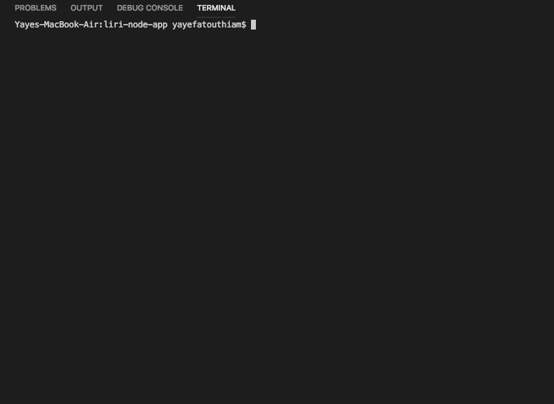
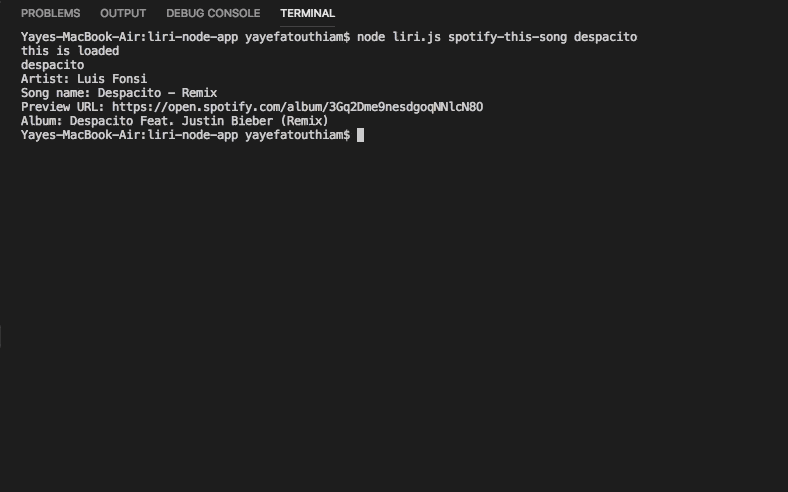

# liri-node-app

## Description
This Langage Interpretation and Recognition Interface is a command line application buid with Node.
It access API's using the user input and display the result in the terminal. 

## Technologies and API used
#### Technologies
* Javascript
* Node js

# API(s)
* OMDB
* Bands In Town
* Spotify
To access the API, the user input is added to the API's query, and the data in a form of JSON objects are retrieved using axios.
The access to the Spotify API is different than the classic ones because the query is a "search" with parameters like the type of the data needed (track, artist...)
Once the data is retrieved, the selected informations are displayed in the terminal.
These datas are also logged in the log.txt file

## How to use Liri
Since it is a command line app, liri can't be deployed but you can still use it. To do so, the following steps will be necessary: 
 1. Follow the link to the gitHup repository, copy and clone it on your computer
 2. Create your own ".env" file where you will put your Sptify API key like this:
    Spotify API keys

    SPOTIFY_ID=your-spotify-id
    SPOTIFY_SECRET=your-spotify-secret

 If you don't have a spotify key, please follow the steps below to get one - it's free:
   * Visit https://developer.spotify.com/my-applications/#!/
   * Either login to your existing Spotify account or create a new one (a free account is fine) and log in.
   * Once logged in, navigate to https://developer.spotify.com/my-applications/#!/applications/create to register a new application to be used with the Spotify API. You can fill in whatever you'd like for these fields. When finished, click the "complete" button.
   * On the next screen, scroll down to where you see your client id and client secret. Copy these values down somewhere, you'll need them to use the Spotify API and the node-spotify-api package.

 3. Install node by typing the command **"npm install"** on the terminal. The terminal should be opened in the project directory
 4. Now you can use LIRI using the following commands depending on the informations you want to display:

    *  __node liri.js concert-this *< name of an artist or a band >*__ 
        The informations below will be displayed: 
        - name of the artist/band
        - name of the venue
        - date of the event

    
    

    If the user type an artist or band that doesn't have a scheduled concert, a message will be show.
    Also, if the user doesn't type an artist or a band name, a message is shown: 

    

    *  __node liri.js spotify-this-song *< song name >*__
        This command will display:
        - Name of the artist
        - Song's name
        - A preview link of the song from Spotify
        - The Album that the song is from

    
    

        If no song is entered, "The Sign" by Ace of Base will be displayed

    

    *  __node liri.js movie-this *< name of a movie >*__
        This will show:
        - The title of the movie,
        - The year the movie came out
        - The IMDB rating of the movie
        - The rotten tomatoes rating of the movie if it exists (for some movies, this data is missing)
        - The country where the movie was produced
        - The language of the movie
        - The plot
        - The actors in the movie

    

        If the user doesn't enter a movie, the program will output data for "Mr Nobody"

    
    

    *  __node liri.js do-what-it-says__
        For this command, there is a *random.txt* file in the directory which contain a command line.
        The default one is *spotify-this-song,"I Want it That Way"*
        The app will read the random.txt file using the fs package of node and *do what it says*

    

All the command entered by the user are appended in the *log.txt* file

